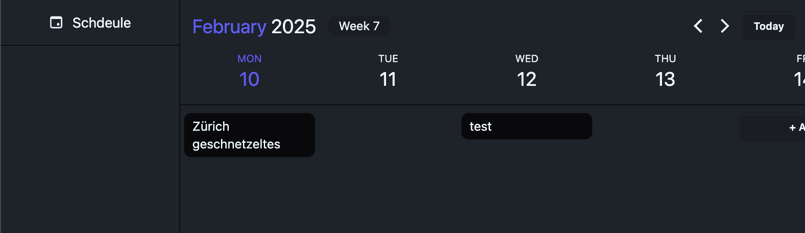

# Electric SQL Local First Demo
This is a small app using electric SQL for a local first architecture.
The local writes are persisted to localStorage and then written to the backend (electric-sql calls this the ["Shared persistent optimistic state"-Pattern](https://electric-sql.com/docs/guides/writes#online-writes).

The app allows you to schedule meals, so you can plan your week. (Just basic CRUD) 
It includes authentication with `better-auth`. 
The fun thing is, since the writes are persisted in the `localStorage` you can just use the app, and sign up when you are ready, when you do, your local writes are automatically added to your account.

## Run locally
1. Start the database and the electric sql service with `docker-compose up`
2. Start the backend (inside `packages/backend`) `deno run dev`
3. Start the frontend (inside `packages/frontend`) `deno run dev`

The Login is on http://localhost:5173/auth/login, and the app on http://localhost:5173/app/schedule

## Stack

### Backend
- hono
- drizzle
- better-auth

### Frontend
- solid.js
- tailwind
- electric-sql client
